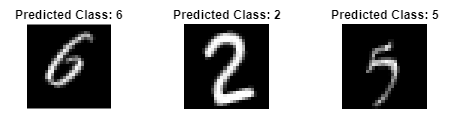
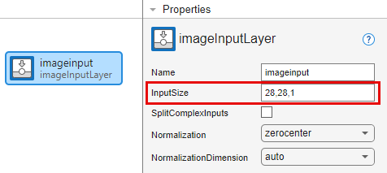
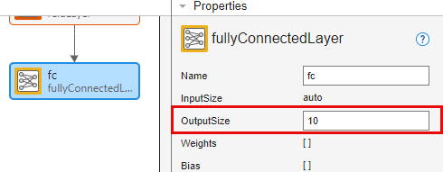
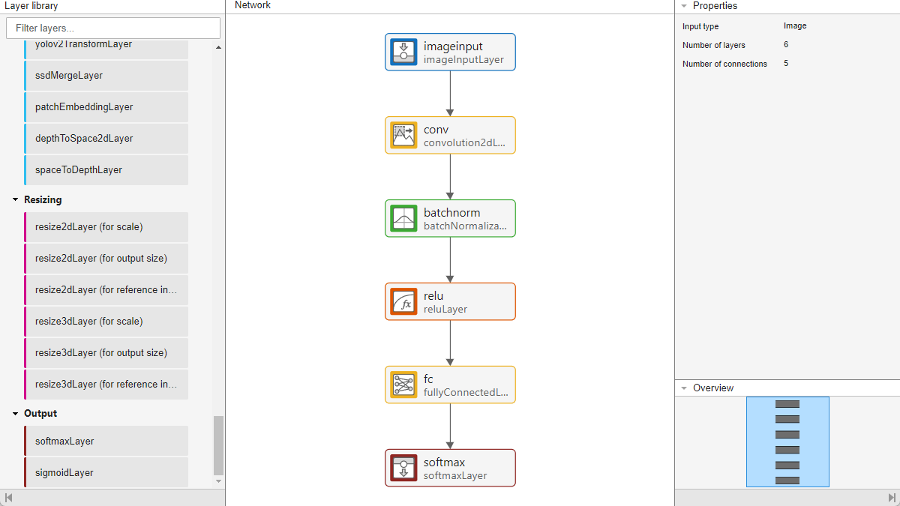
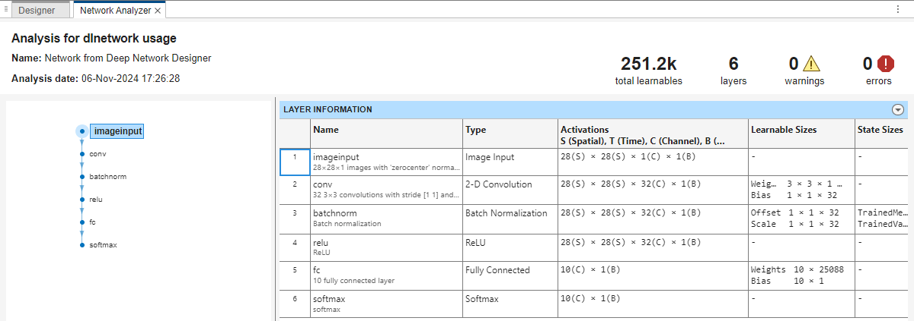
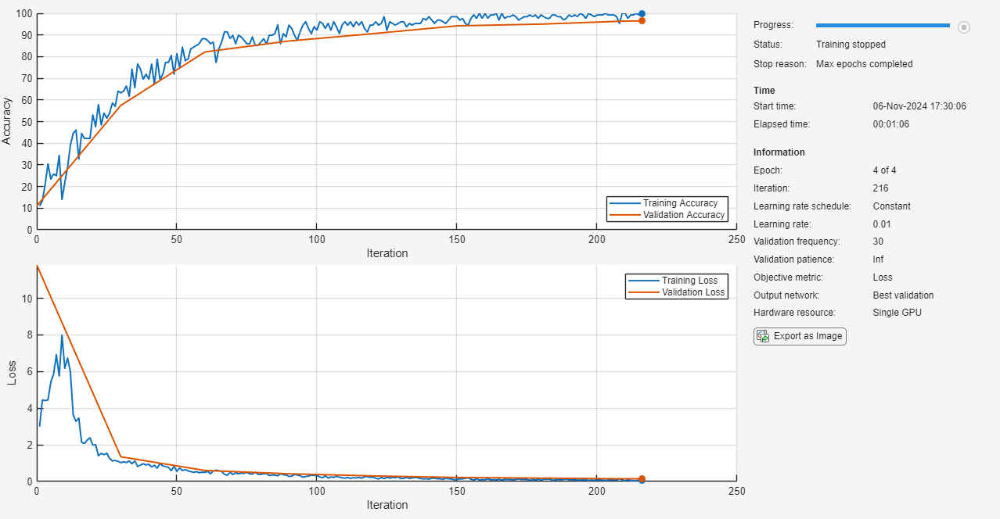

# Ejemplo 3: NN_ex3.m
**Author:** Dr. Aboud Barsekh Onji
**Institution:** IPN - Universidad Anáhuac México
**Contact:** aboud.barsekh@anahuac.mx
**ORCID:** 0009-0004-5440-8092

Este ejemplo ilustra cómo crear, entrenar y evaluar una **Red Neuronal Convolucional (CNN)** sencilla para la clasificación de imágenes (dígitos manuscritos) utilizando la app **Deep Network Designer** y el flujo de trabajo moderno de MATLAB (`trainnet`).

---

## 1. Flujo de Trabajo con Deep Network Designer

El ejemplo utiliza la app interactiva para construir la arquitectura de la red visualmente.

1.  **Diseño:** Se arrastran las capas desde la biblioteca y se conectan.
2.  **Análisis:** Se verifica la compatibilidad de dimensiones (botón *Analyze*).
3.  **Exportación:** Se exporta la red al workspace de MATLAB (variable `net_1`) para su entrenamiento.

---

## 2. Explicación de la Arquitectura (Capas)

La red construida consta de las siguientes capas secuenciales, diseñadas para extraer características y clasificar:

### A. Capas de Entrada y Convolución

1.  **`imageInputLayer` ([28 28 1]):**
    *   Define el tamaño de las imágenes de entrada: 28x28 píxeles y 1 canal (escala de grises).
    *   **Propósito:** Normaliza los datos (por defecto, resta la media) para facilitar el entrenamiento.

2.  **`convolution2dLayer` (FilterSize=3, NumFilters=32):**
    *   **Función:** Aplica 32 filtros deslizantes de tamaño 3x3 sobre la imagen.
    *   **Qué hace:** Detecta características locales como bordes, esquinas o texturas simples.
    *   **Salida:** Genera un volumen de características donde la profundidad es igual al número de filtros (32).

3.  **`batchNormalizationLayer`:**
    *   **Función:** Normaliza las salidas de la capa anterior (activaciones) restando la media y dividiendo por la desviación estándar del lote.
    *   **Por qué se usa:** Estabiliza el aprendizaje, permite usar tasas de aprendizaje más altas y reduce la dependencia de la inicialización de pesos.

4.  **`reluLayer` (Rectified Linear Unit):**
    *   **Función:** Aplica la función de activación $f(x) = \max(0, x)$.
    *   **Por qué se usa:** Introduce **no linealidad** en el modelo, permitiendo que la red aprenda funciones complejas y no solo transformaciones lineales. Convierte los valores negativos a cero.

### B. Capas de Clasificación y Salida

5.  **`fullyConnectedLayer` (OutputSize=10):**
    *   **Función:** Conecta todas las neuronas de la capa anterior con las 10 neuronas de salida (una por cada dígito del 0 al 9).
    *   **Qué hace:** Combina todas las características locales extraídas para tomar una decisión global.

6.  **`softmaxLayer`:**
    *   **Función:** Aplica la función Softmax a la salida.
    *   **Qué hace:** Convierte los valores crudos (*logits*) en **probabilidades** que suman 1.

7.  **`classificationLayer` (o uso de `crossentropy` en `trainnet`):**
    *   Calcula la pérdida del modelo durante el entrenamiento comparando la probabilidad predicha con la etiqueta real.

---

## 3. Entendiendo las Dimensiones: S, T, C, B

En el **Deep Network Analyzer** (y en tablas de resumen de MATLAB), verás dimensiones etiquetadas como **S**, **T**, **C**, **B**. Esto es crucial para entender cómo fluyen los datos.

| Letra | Significado (Inglés) | Significado (Español) | Explicación en este Ejemplo |
| :--- | :--- | :--- | :--- |
| **S** | **Spatial** | **Espacial** | Dimensiones de altura y anchura de la imagen o mapa de características.   *Ejemplo:* En la entrada es 28x28. Tras la convolución (sin padding) se reduce ligeramente (26x26). |
| **T** | **Time** | **Tiempo** | Dimensión temporal o secuencial.   *Ejemplo:* En imágenes estáticas, **T = 1** (no hay secuencia). En videos o audio, T sería la duración. |
| **C** | **Channel** | **Canal** | Número de canales o profundidad de características.   *Ejemplo:* Entrada = 1 (grises). Salida de Convolución = 32 (filtros). |
| **B** | **Batch** | **Lote** | Tamaño del lote (*Batch Size*) procesado simultáneamente.   *Ejemplo:* Durante el entrenamiento, B podría ser 128 imágenes procesadas a la vez. |

---

## 4. Entrenamiento y Resultados

El entrenamiento se visualiza en tiempo real, mostrando la precisión (*Accuracy*) y la pérdida (*Loss*).

Al finalizar, se puede evaluar la red con imágenes de validación para ver las predicciones:

