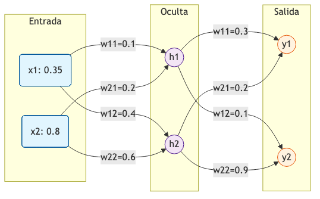

# Solución Paso a Paso: Problema de Redes Neuronales con SGDM

Este documento presenta la solución para el mismo problema de entrenamiento (un paso de Backpropagation) abordado anteriormente, pero aplicando el algoritmo de optimización **Stochastic Gradient Descent with Momentum (SGDM)**.

### Diagrama de la Red

**Autor:** Dr. Aboud Barsekh Onji
**Institución:** IPN - Universidad Anáhuac México

---

## 1. Planteamiento del Problema

Se tiene una red neuronal multicapa con la siguiente configuración:

*   **Arquitectura:** 2 Entradas - 2 Ocultas - 2 Salidas.
*   **Entradas ($X$):** $x_1 = 0.35$, $x_2 = 0.8$.
*   **Salida Deseada ($Target$):** $t = 0.5$ (Asumiremos $t_1=0.5$ y $t_2=0.5$).
*   **Hiperparámetros:**
    *   Tasa de Aprendizaje ($\eta$): $0.2$.
    *   **Momentum ($\alpha$):** $0.9$ (Parámetro adicional para SGDM).
*   **Función de Activación:** Log-Sigmoid para todas las neuronas:
    $$ \sigma(z) = \frac{1}{1 + e^{-z}} $$
    *Derivada:* $\sigma'(z) = \sigma(z)(1 - \sigma(z))$.

### Pesos Iniciales (Iguales al ejemplo original)

**Capa 1 (Entrada $\to$ Oculta):**
*   $w_{11}^{(1)} = 0.1$
*   $w_{21}^{(1)} = 0.2$
*   $w_{12}^{(1)} = 0.4$
*   $w_{22}^{(1)} = 0.6$

**Capa 2 (Oculta $\to$ Salida):**
*   $w_{11}^{(2)} = 0.3$
*   $w_{21}^{(2)} = 0.2$
*   $w_{12}^{(2)} = 0.1$
*   $w_{22}^{(2)} = 0.9$

---

## 2. Fase 1: Propagación hacia Adelante (Forward Propagation)

*Nota: Esta fase es idéntica al cálculo con SGD estándar, ya que solo depende de los pesos actuales.*

### Capa Oculta ($H$)

**Neurona $h_1$:**
$$ net_{h1} = (0.35)(0.1) + (0.8)(0.2) = \mathbf{0.195} $$
$$ out_{h1} = \frac{1}{1 + e^{-0.195}} \approx \mathbf{0.5486} $$

**Neurona $h_2$:**
$$ net_{h2} = (0.35)(0.4) + (0.8)(0.6) = \mathbf{0.62} $$
$$ out_{h2} = \frac{1}{1 + e^{-0.62}} \approx \mathbf{0.6502} $$

### Capa de Salida ($O$)

**Neurona $o_1$:**
$$ net_{o1} = (0.5486)(0.3) + (0.6502)(0.2) = 0.16458 + 0.13004 = \mathbf{0.2946} $$
$$ out_{o1} = \frac{1}{1 + e^{-0.2946}} \approx \mathbf{0.5731} $$

**Neurona $o_2$:**
$$ net_{o2} = (0.5486)(0.1) + (0.6502)(0.9) = 0.05486 + 0.58518 = \mathbf{0.6400} $$
$$ out_{o2} = \frac{1}{1 + e^{-0.6400}} \approx \mathbf{0.6548} $$

---

## 3. Fase 2: Cálculo del Error y Retropropagación (Backpropagation)

*Nota: Esta fase también es idéntica al cálculo con SGD estándar, ya que los gradientes se calculan igual.*

### Error en la Salida ($\delta_o$)
Ecuación: $\delta = (out - target) \cdot out(1 - out)$

**Para $o_1$:**
$$ \delta_{o1} = (0.5731 - 0.5) \cdot 0.5731(1 - 0.5731) \approx \mathbf{0.0179} $$

**Para $o_2$:**
$$ \delta_{o2} = (0.6548 - 0.5) \cdot 0.6548(1 - 0.6548) \approx \mathbf{0.0350} $$

### Error en la Capa Oculta ($\delta_h$)
Ecuación: $\delta_h = (\sum \delta_o w) \cdot out_h(1 - out_h)$

**Para $h_1$:**
$$ \delta_{h1} = [(0.0179)(0.3) + (0.0350)(0.1)] \cdot 0.5486(1 - 0.5486) $$
$$ \delta_{h1} \approx 0.00887 \cdot 0.2476 \approx \mathbf{0.0022} $$

**Para $h_2$:**
$$ \delta_{h2} = [(0.0179)(0.2) + (0.0350)(0.9)] \cdot 0.6502(1 - 0.6502) $$
$$ \delta_{h2} \approx 0.03508 \cdot 0.2274 \approx \mathbf{0.0080} $$

---

## 4. Fase 3: Actualización de Pesos con SGDM

Aquí es donde el algoritmo difiere del SGD estándar.

### Fórmula SGDM
Introducimos un término de velocidad $v$.
1.  **Cálculo de la Velocidad:** $v_t = \alpha v_{t-1} + \eta \nabla E$
    *   Donde $\nabla E = \delta \cdot input$ (el gradiente).
    *   $\alpha = 0.9$ (factor de momentum).
    *   $\eta = 0.2$ (tasa de aprendizaje).
2.  **Actualización de Peso:** $w_{new} = w_{old} - v_t$

**Nota Importante:** Como este es el **primer paso ($t=1$)**, asumimos que la velocidad anterior es cero ($v_0 = 0$). Por lo tanto:
$$ v_1 = 0.9(0) + 0.2(\nabla E) = 0.2(\nabla E) $$
$$ w_{new} = w_{old} - 0.2(\nabla E) $$
*Esto significa que numéricamente, el resultado del primer paso será idéntico al SGD. Sin embargo, calcularemos explícitamente el término $v$ para ilustrar el método.*

---

### Actualización Capa Oculta $\to$ Salida

**Peso $w_{11}^{(2)}$ (de $h_1$ a $o_1$):**
*   Gradiente ($\nabla E$) = $\delta_{o1} \cdot out_{h1} = 0.0179 \cdot 0.5486 = 0.00982$
*   Velocidad ($v_{11}^{(2)}$) = $0.9(0) + 0.2(0.00982) = \mathbf{0.00196}$
*   Nuevo Peso: $w_{11}^{(2)+} = 0.3 - 0.00196 = \mathbf{0.2980}$

**Peso $w_{21}^{(2)}$ (de $h_2$ a $o_1$):**
*   Gradiente = $\delta_{o1} \cdot out_{h2} = 0.0179 \cdot 0.6502 = 0.01164$
*   Velocidad ($v_{21}^{(2)}$) = $0.9(0) + 0.2(0.01164) = \mathbf{0.00233}$
*   Nuevo Peso: $w_{21}^{(2)+} = 0.2 - 0.00233 = \mathbf{0.1977}$

**Peso $w_{12}^{(2)}$ (de $h_1$ a $o_2$):**
*   Gradiente = $\delta_{o2} \cdot out_{h1} = 0.0350 \cdot 0.5486 = 0.01920$
*   Velocidad ($v_{12}^{(2)}$) = $0.9(0) + 0.2(0.01920) = \mathbf{0.00384}$
*   Nuevo Peso: $w_{12}^{(2)+} = 0.1 - 0.00384 = \mathbf{0.0962}$

**Peso $w_{22}^{(2)}$ (de $h_2$ a $o_2$):**
*   Gradiente = $\delta_{o2} \cdot out_{h2} = 0.0350 \cdot 0.6502 = 0.02276$
*   Velocidad ($v_{22}^{(2)}$) = $0.9(0) + 0.2(0.02276) = \mathbf{0.00455}$
*   Nuevo Peso: $w_{22}^{(2)+} = 0.9 - 0.00455 = \mathbf{0.8954}$

---

### Actualización Capa Entrada $\to$ Oculta

**Peso $w_{11}^{(1)}$ (de $x_1$ a $h_1$):**
*   Gradiente = $\delta_{h1} \cdot x_1 = 0.0022 \cdot 0.35 = 0.00077$
*   Velocidad ($v_{11}^{(1)}$) = $0.9(0) + 0.2(0.00077) = \mathbf{0.00015}$
*   Nuevo Peso: $w_{11}^{(1)+} = 0.1 - 0.00015 = \mathbf{0.0998}$

**Peso $w_{21}^{(1)}$ (de $x_2$ a $h_1$):**
*   Gradiente = $\delta_{h1} \cdot x_2 = 0.0022 \cdot 0.8 = 0.00176$
*   Velocidad ($v_{21}^{(1)}$) = $0.9(0) + 0.2(0.00176) = \mathbf{0.00035}$
*   Nuevo Peso: $w_{21}^{(1)+} = 0.2 - 0.00035 = \mathbf{0.1996}$

**Peso $w_{12}^{(1)}$ (de $x_1$ a $h_2$):**
*   Gradiente = $\delta_{h2} \cdot x_1 = 0.0080 \cdot 0.35 = 0.0028$
*   Velocidad ($v_{12}^{(1)}$) = $0.9(0) + 0.2(0.0028) = \mathbf{0.00056}$
*   Nuevo Peso: $w_{12}^{(1)+} = 0.4 - 0.00056 = \mathbf{0.3994}$

**Peso $w_{22}^{(1)}$ (de $x_2$ a $h_2$):**
*   Gradiente = $\delta_{h2} \cdot x_2 = 0.0080 \cdot 0.8 = 0.0064$
*   Velocidad ($v_{22}^{(1)}$) = $0.9(0) + 0.2(0.0064) = \mathbf{0.00128}$
*   Nuevo Peso: $w_{22}^{(1)+} = 0.6 - 0.00128 = \mathbf{0.5987}$

---

## Resumen de Resultados SGDM (Paso 1)

En este primer paso, los valores finales son idénticos al SGD estándar. Sin embargo, hemos calculado y almacenado los valores de velocidad ($v$) para cada peso, los cuales se utilizarán en la siguiente iteración ($t=2$), momento en el cual los caminos de SGD y SGDM comenzarán a divergir.

| Peso | Gradiente ($\nabla E$) | Velocidad ($v_1$) | Nuevo Valor |
| :--- | :--- | :--- | :--- |
| **Capa 2** | | | |
| $w_{11}^{(2)}$ | 0.00982 | 0.00196 | **0.2980** |
| $w_{22}^{(2)}$ | 0.02276 | 0.00455 | **0.8954** |
| **Capa 1** | | | |
| $w_{11}^{(1)}$ | 0.00077 | 0.00015 | **0.0998** |
| $w_{12}^{(1)}$ | 0.00280 | 0.00056 | **0.3994** |
